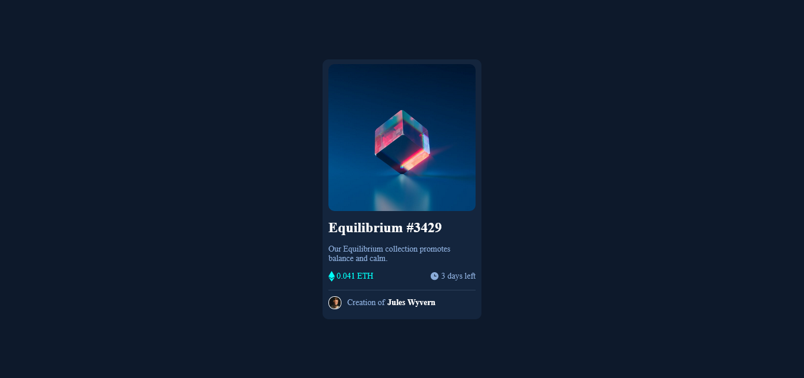

# Frontend Mentor - NFT preview card component solution

This is a solution to the [NFT preview card component challenge on Frontend Mentor](https://www.frontendmentor.io/challenges/nft-preview-card-component-SbdUL_w0U).

### Screenshot

### Links

- Solution URL: [GitHub](https://github.com/rahulgtst/nft-preview-card)
- Live Site URL: [Live Site](https://rahulgtst.github.io/nft-preview-card/)

### Built with

- Semantic HTML5 markup
- CSS custom properties
- Flexbox

## Author

- LinkedIn - [@rhlgt](https://www.linkedin.com/in/rhlgt/)
- Frontend Mentor - [@rahul8858](https://www.frontendmentor.io/profile/rahul8858)
- Twitter - [@rahulgtst](https://www.twitter.com/rahulgtst)
